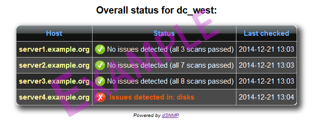

## dSNMP - Dell SNMP/WBEM monitoring system ##

============================================

This is a Dell (OpenManage) SNMP/WBEM monitoring system with HipChat, PagerDuty and email integration.
It also works with generic UNIX net-snmp daemons for more standard checks such as space, free mem and load averages.

Tested with Dell PowerEdge R410, R515 and R720 with PERC RAID controllers, as well as Linux and FreeBSD VMs with net-snmp.

Originally created for the Apache Software Foundation by Quokka IvS. 
As such, there may still be ASF-centric checks and logic in the code that you may need to change to suit your own needs.

## Requirements
- Python 2.7 or newer (will work with 2.6, barely)
- Access to SNMP servers via SNMP v2c
- snmp tools installed (snmpget + snmpwalk)
- pywbem (`pip install pywbem`)

## Getting started ##
- Download the script and sample configuration
- Fix settings.json to match your hardware and http server configuration.
- Run `python dsnmp.py --daemonize` and have coffee!

## Command line options
- `--port $port`: Serve up status pages from a small HTTP server off port $port (as opposed to using an existing web server)
- `--dry-run`: Just run the scans and generate reports, but do not alert via HipChat, PagerDuty or email if issues are detected. Great for debugging.
- `--daemonize`: Run dSNMP as a background daemon.

## Extending to dynamically added hosts ##
If you don't like restarting the script to add new hosts/checks,
you can specify a `hostsfile` option in the json, pointing to an external json file on a HTTP server.
If you do this, please leave the `hosts` record as a blank hash:
~~~
   ...,
   "hosts": {},
   "hostsfile": "https://www.example.org/hosts.json",
   ...
~~~

## Checks ##
Checks are run every 15 minutes. If an issue is found, alerts will be provided through HipChat, PagerDuty and email on a regular basis (HipChat every 4 hours or at 8 PM if no issues, PagerDuty when issues are detected (depending on what the alert dial is set to, email once a day).

### The following standard UNIX SNMP checks are valid:

 - `load`:        5, 10, 15 min load averages (alerts if 15 min is above what N cores can provide for. Triggers after 45 min of this)
 - `cpuidle`:     Shows how much cpu is idle at the time. Does not trigger alerts
 - `memfree`:     Shows how much memory (including buffers) is free. Alerts if <100mb free.
 - `uptime`:      Shows uptime. Does not trigger an alert
 - `memory`:      Shows the total amount of memory installed. Does not trigger an alert, unless faulty memory is detected (Dell specific)
 - `cores`:       Lists the number of CPU cores found on the system. Does not trigger alerts
 - `space`:       Lists the available partitions on the disk if >= 75% space used. Triggers an alert if >=75% space used on a partition.
 
 
### The following Dell specific SNMP checks are valid:
 
 - `perc`:        Displays the status of the PERC RAID controller and its volumes. Alerts if a volume is degraded or otherwise compromised
 - `array`:       Displays the status of the OS arrays. Alerts if a disk is in a wrong state (degraded, faulted, offline etc)
 - `disks`:       Displays the state of each disk in the machine. Alerts if a disk is not online or passthrough.
 - `psu`:         Displays the status of the Power Supply Unit. Alerts if PSU is in a bad state.
 - `prod`:        Displays the product name and service tag of a machine. Does not trigger alerts
 - `memory`:      Displays the amount of installed memory, and if a dimm is faulted, also triggers an alert.
 - `status`:      Displays the combined status of the entire machine. Alerts if status is not okay. Does not explain why.
 - `cooling`:     Displays the combined status of the cooling devices in the machine. Alerts if devices are not working.
 - `battery`:     Displays the combined battery status of the machine. Alerts if any batteries are not working.
 - `temperature`: Displays the overall temperature status. Triggers an alert if temperatures are outside acceptable range (71.4 C for ambient, intake & exhaust, 85.6 C for cpu, 52.4 C for drives)
 - `log`:         Displays the latest log entries from iDRAC. Does not trigger any alerts.
 - `diskinfo`:    Displays information about the disks in the machine. Does not trigger any alerts.
 - `systimes`:    A long-lived query (20-30 seconds) that returns current system utilization. Should only be queried via HipChat, not as a standard check. Does not trigger alerts.

### The following WBEM specific checks are valid:

 - `temperature`: Displays the overall temperature status. Triggers an alert if temperatures are outside acceptable range (71.4 C for ambient, intake & exhaust, 85.6 C for cpu, 52.4 C for drives)
 - `psu`:         Displays the status of the Power Supply Unit. Alerts if PSU is in a bad state.
 - `array`:       Displays the status of the OS arrays. Alerts if a disk is in a wrong state (degraded, faulted, offline etc)
 - `raid`:        Displays the status of the RAID controller and its volumes. Alerts if a volume is degraded or otherwise compromised
 - `cores`:       Lists the number of CPU cores found on the system. Does not trigger alerts
 - `memory`:      Displays the amount of installed memory, and if a dimm is faulted, also triggers an alert.
 - `disks`:       Displays the state of each disk in the machine. Alerts if a disk is not online or passthrough.
 

## Alert dial
To prevent overzealous reporting, the `alertdial` setting in settings.json controls when alerts are sent out. For each increment of 1 of the dial, dsnmp will wait one more turn (15 min) before alerting, or put differently; if the same error has been detected more than $alertdial times, the alert will be triggered. The default setting for this is 2, meaning an alert will trigger if the issue persists for 30-45 minutes.

# HipChat commands ##
 To trigger a check via HipChat (assuming the daemon is running), use the following syntax:
 `#snmp $host $check [$community]`.
 For example: `#snmp server1 disks`. 
 
 To use WBEM commands, use `#wbem $host $check`.
 
 To list all available check types use either `#snmp help` or `#wbem help`.
 
 If the specific host is in your settings.json file (or in the remote hosts file), you do not need to specify an SNMP community, but if it's not, then you will need to specify it as the third and last arg to the command. The `suffix` variable inside snmp.py is automatically appended to the host name, thus `server1` becomes `server1.example.com` unless you change the suffix (you can leave it blank).
 
 To get an overall status of the latest run of checks, type: `#snmpstatus`
 

# Using without HipChat or PagerDuty:

It is possible to use dSNMP without HipChat or PagerDuty integration, and just have web/email features.
To do so, simply remove the `hipchat` or `pd` entries in `settings.json`.
